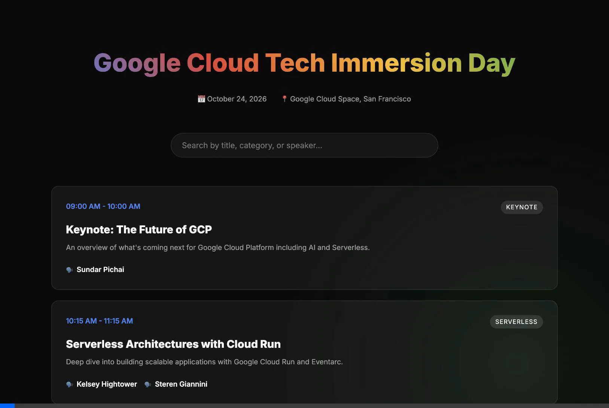

# Google Cloud Tech Conference Website

A full-stack project building a 1-day tech conference website with backend API (Flask) and Frontend via React. 
This avoids node dependencies by leveraging CDN versions of React for maximum compatibility.



## Tech Stack
- **Backend:** Python + Flask
- **Frontend:** React (via unpkg CDN), Babel, HTML, Vanilla CSS with Glassmorphic details.

## Setup Instructions

### 1. Backend Setup

Launch a terminal and navigate to the `backend` directory.

```bash
cd backend
pip install -r requirements.txt
python3 app.py
```

The backend server will start at `http://127.0.0.1:5000/`.

### 2. Frontend Setup

In a new terminal window, navigate to the `frontend` directory and serve it using any simple HTTP server (Python is recommended since it is already installed).

```bash
cd frontend
python3 -m http.server 8000
```

The frontend will be available at `http://127.0.0.1:8000/`.

### Access the Application
Open `http://localhost:8000` in your web browser. 
The timeline, lunch breaks, and data fetches directly from your Flask instance!
